# ⚡ Quick Benchmark Summary: Maximal Effort Skill v2.0 vs Vanilla GPT-4 Prompt (No Skill)

> **Key Finding**: `Maximal Effort Skill v2.0` achieved **98.0% pass rate** (vs 54.0% baseline) with a **Large Effect (PASS)** ($p = 0.0001$, $d = 4.82$).

---

### 📊 Performance at a Glance

| Metric | Baseline (Vanilla GPT-4 Prompt (No Skill)) | **Candidate (Maximal Effort Skill v2.0)** | Win Margin |
| :--- | :--- | :--- | :--- |
| **Test Pass Rate** | 54.0% | **98.0%** | **Large Effect (PASS)** |
| **Avg Wall Time** | 4200.0 ms | **1800.0 ms** | **Negligible** |
| **Composite Index** | 35.0 / 100 | **81.0 / 100** | **P(A>B): 100.0%** |

```mermaid
gantt
    title Execution Speed Comparison (Lower is Better)
    dateFormat X
    axisFormat %s sec
    section Baseline (Vanilla GPT-4 Prompt (No Skill))
    4.2s : 0, 42.0
    section Candidate (Maximal Effort Skill v2.0)
    1.8s : 0, 18.0
```

---

### 🧪 Key Test Case Highlights
1. **Luau DataStore Module Test**: Candidate generated 100% compilation-ready retry logic with zero `TODO` comments.
2. **Memory Leak Debugging Test**: Candidate identified root-cause unhooked signal connections in 1.4s.
3. **Architecture Contract Test**: Candidate separated client/server boundaries strictly adhering to DRY principles.

👉 **[Read Full Exhaustive Scientific Report (BENCHMARK.md)](file:///./BENCHMARK.md)** for complete statistical proofs, DAG Evidence Graph, and full testcase data points.