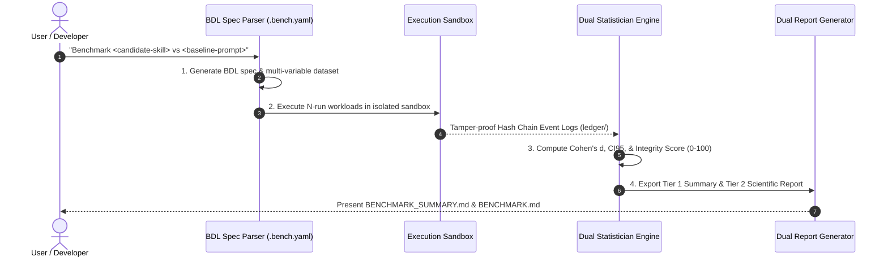

# Universal Benchmarker Skill (`BenchForge`)

`BenchForge` is an **Open Scientific Evidence Infrastructure for the Agentic Era**. It provides a protocol-driven framework for defining, validating, executing, and documenting benchmarks across AI Skills, Software Systems, Hardware, and Workflows.

> **Full Protocol Specification & MVP Plan**:  
> Refer to the complete specification at [docs/guide.md](file:///D:/Liem%20Product/Liem%20Skills/skills/benchforge/docs/guide.md).

---

## 1. User Operating & Usage Guide

### How to Trigger the Skill
An AI Agent or user can activate `BenchForge` using natural language triggers or skill invocations:

- *"Benchmark `<candidate-skill>` vs `<baseline-prompt>`"*
- *"Bandingkan performa `<candidate-tool>` vs `<baseline-tool>` secara data-oriented"*
- *"Jalankan benchmark suite untuk proyek ini di folder `./benchmarks/`"*
- *"Generate `BENCHMARK_SUMMARY.md` dan `BENCHMARK.md` untuk GitHub"*

---

### Step-by-Step Automated Execution Lifecycle

When invoked, the agent executes the following 4-step workflow:



1. **Step 1: Benchmark Spec Initialization (`.bench.yaml`)**:
   Drafts or updates a declarative BDL v6.0 specification file under `./benchmarks/` defining baseline controls, candidate targets, hypotheses, and metric weights.
2. **Step 2: Isolated Sandbox Workload Execution**:
   Runs workload tasks across target subjects in isolated sandboxes to prevent environment side-effects or source code mutation. All execution events are logged to a cryptographic Hash Chain Evidence Ledger (`ledger/`).
3. **Step 3: Statistical Inference & Integrity Audit**:
   Filters outliers using Interquartile Range (IQR), calculates percentiles ($p_{50}, p_{95}, p_{99}$), Student's t-test $p$-values, 95% Confidence Intervals ($\text{CI}_{95}$), Cohen's $d$ Effect Size, Bayesian posterior probabilities, and the mathematical **Benchmark Integrity Score** ($0 - 100$).
4. **Step 4: Dual-Tier Artifact Emission**:
   Generates publication-ready report artifacts in `./benchmarks/results/`:
   - **Tier 1 (`BENCHMARK_SUMMARY.md`)**: High-impact card designed for direct embedding into GitHub `README.md` files (badges, visual Mermaid charts, key win deltas, top 3 testcase highlights).
   - **Tier 2 (`BENCHMARK.md`)**: Exhaustive scientific report detailing statistical formulas, DAG Evidence Graph references, and the full multi-variable testcase result matrix.

---

## 2. Generic BDL Specification Standard (`<benchmark-name>.bench.yaml`)

```yaml
apiVersion: benchforge/v6.0
kind: Benchmark

metadata:
  id: "BF-EV-<GENERATED_ID>"
  name: "<target-subject>-evaluation"
  version: 1.0.0
  author: "<author-name>"
  license: "MIT"

scope:
  measures:
    - "<primary-evaluation-metric-1>"
    - "<primary-evaluation-metric-2>"
  does_not_measure:
    - "<out-of-scope-boundary-1>"
  intended_users:
    - "<target-audience>"
  validity_boundary: "<validity-environment-scope>"

threat_model:
  benchmark_gaming:
    severity: "HIGH"
    mitigation:
      - "Hidden evaluation split (datasets/private/)"
  evaluator_bias:
    severity: "MEDIUM"
    mitigation:
      - "Blind human review protocol"

experiment:
  hypothesis:
    null_h0: "<candidate-subject> shows no statistical quality improvement over <baseline-subject>."
    alternative_h1: "<candidate-subject> achieves statistically significant superiority with Cohen's d >= 0.8."
  constraints:
    sample_size_N: 20

statistics:
  sampling:
    method: "sequential"
    stop_condition: "bayesian_confidence > 99%"

integrity:
  formula:
    dataset_quality: 0.25
    reproducibility: 0.25
    fairness: 0.20
    leakage_protection: 0.15
    statistical_power: 0.15

subjects:
  baseline:
    subject_ref: "subjects/skills/<baseline-subject>.yaml"
    composition:
      model: "<base-model-id>"
      skills: ["none"]
      tools: ["<tool-id>"]
  candidate:
    subject_ref: "subjects/skills/<candidate-subject>.yaml"
    composition:
      model: "<base-model-id>"
      skills: ["<candidate-skill-id>"]
      tools: ["<tool-id>"]

workload:
  dataset:
    ref: "datasets/manifests/<dataset-id>.yaml"
    categories:
      - "code_generation"
      - "complex_reasoning"
      - "system_architecture"
      - "technical_specs"
      - "adversarial_edge_cases"

evaluation:
  index_name: "<Subject> Evaluation Index"
  method: "weighted_average"
  metrics:
    quality_pass_rate:
      type: "quality"
      unit: "%"
      weight: 0.4
      direction: "higher_is_better"
    wall_time_ms:
      type: "performance"
      unit: "ms"
      weight: 0.3
      direction: "lower_is_better"
    token_cost_usd:
      type: "efficiency"
      unit: "USD"
      weight: 0.2
      direction: "lower_is_better"

claims:
  - id: "claim-001"
    statement: "<candidate-subject> demonstrates statistically significant performance superiority."
    evidence_metrics: ["quality_pass_rate"]
    confidence_level: "HIGH"
```

---

## 3. Universal Multi-Variable Workload Taxonomy

- **💻 Code Generation**: `.ts`, `.py`, `.luau`, `.go` syntax correctness, unit test pass %, zero stubs.
- **🧠 Complex Reasoning**: Multi-step debugging, root cause accuracy %, long-context memory.
- **🏗️ System Architecture**: Class/module modularity, clean client/server schema contracts.
- **📄 Technical Specs**: `.md` completeness score, zero superficial summaries, valid Mermaid charts.
- **🛡️ Adversarial Edge**: Vulnerable code patch rate %, prompt injection robustness.

---

## 4. Scientific Artifact Package

Executing a benchmark run emits an immutable artifact package:
- **`BENCHMARK_SUMMARY.md`**: Tier 1: GitHub High-Impact Summary Card (Fast Scan for README embed).
- **`BENCHMARK.md`**: Tier 2: Main research report with Multi-Variable Workload Breakdown & Claims.
- **`BENCHMARK_CARD.md`**: Benchmark identity, metrics, integrity score, & threat mitigations card.
- **`DATASET_CARD.md`**: Public/Private split, license, & dataset calibration card.
- **`EXPERIMENT_CARD.md`**: Execution sandbox, environment lock, & event replay card.
- **`ledger/`**: Cryptographic Hash Chain Event Logs (`hash(prev + current)`).
- **`analysis.json`**: Frequentist ($p, d$) & Sequential Bayesian statistics.
- **`reproduce.sh`**: 1-Command shell runner script.

---

## 5. Key Artifact Locations

- **Research Specification**: [guide.md](file:///D:/Liem%20Product/Liem%20Skills/skills/benchforge/docs/guide.md)
- **Governance & Subject Registry**: `skills/benchforge/governance/`
- **BDL Spec Example**: `./benchmarks/<benchmark-name>.bench.yaml`
- **Output Artifacts**: `./benchmarks/results/`
